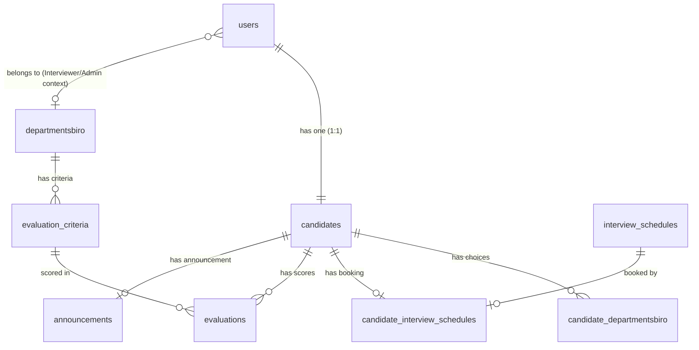

# Panduan Pengembangan Aplikasi HIMATIK DSS (Decision Support System)

Dokumen ini berfungsi sebagai acuan teknis dan analisis sistem untuk pengembangan aplikasi **HIMATIK Decision Support System (DSS)**. Panduan ini mencakup tinjauan arsitektur, struktur basis data, analisis algoritma *Profile Matching*, daftar inkonsistensi/bug yang ada, serta panduan langkah pengembangan ke depan.

---

## 1. Tinjauan Arsitektur & Teknologi

Aplikasi ini dirancang dengan arsitektur **hybrid** yang melayani dua jenis klien:
1. **Web Client (Admin & Interviewer)**: Menggunakan teknologi **Laravel Blade** + **Tailwind CSS 4** + **Alpine.js** dengan bundler **Vite**.
2. **Mobile Client (Candidate)**: Aplikasi mobile berbasis **Flutter** yang berinteraksi dengan Laravel melalui **RESTful API** yang diamankan oleh **Laravel Sanctum**.

### Komponen Utama Proyek
*   **Routing**:
    *   Web: `web/routes/web.php` (Menggunakan session auth)
    *   API: `web/routes/api.php` (Menggunakan token auth via Sanctum)
*   **Controller**:
    *   Web Controller: `web/app/Http/Controllers/Web/`
    *   API Controller: `web/app/Http/Controllers/Api/`
*   **Business Logic (Services)**:
    *   `ProfileMatchingService`: Menangani komputasi SPK.
    *   `CandidateProfileService`: Membuat profil kandidat beserta relasinya secara transaksional.
    *   `CandidateOtpService`: Menangani siklus hidup kode OTP via email.
    *   `OpenRecruitmentService`: Mengelola periode pembukaan pendaftaran.

---

## 2. Struktur Database & Model Data

Aplikasi menggunakan skema database relasional dengan poin penting sebagai berikut:



### Konvensi dan Asumsi Kunci
1.  **Pemisahan Data Akun dan Profil Fisik**:
    *   Data identitas dasar mahasiswa seperti `nim`, `nickname`, `prodi`, `kelas`, `phone`, dan `address` disimpan di tabel **`users`**, bukan `candidates`.
    *   Tabel **`candidates`** hanya menyimpan informasi relasional pendaftaran, esai (`department_choice_reason`, `weakness_description`, `contribution_plan`), tautan dokumen fisik/bukti upload (`photo_path`, dll), serta `status`.
2.  **Pilihan Departemen**:
    *   Pilihan departemen disimpan pada tabel relasional `candidate_departmentsbiro` dengan kolom `choice_order` (1 untuk Pilihan Pertama, 2 untuk Pilihan Kedua).
3.  **Penjadwalan**:
    *   Tabel `interview_schedules` menyimpan data sesi dengan kolom `date`, `start_time`, `end_time`, dan `is_blocked`.
    *   Tabel lama `interviewer_schedule` telah dihapus (dropped) pada migrasi terbaru.

---

## 3. Penjelasan Algoritma Profile Matching (SPK)

Proses komputasi dilakukan di [ProfileMatchingService.php](file:///home/takofaru/Data/tugas/semester-4/project/himatik_dss/himatik_dss_web/web/app/Services/ProfileMatchingService.php). Langkah-langkahnya adalah sebagai berikut:

### Langkah 1: Menghitung Gap Nilai
Untuk setiap kriteria penilaian aktif pada departemen pilihan kandidat:
$$\text{Gap} = \text{Nilai Aktual} - \text{Nilai Target}$$
*   **Nilai Aktual**: Diberikan oleh interviewer pada skala 1-5 saat proses wawancara.
*   **Nilai Target**: Ditentukan pada kriteria departemen (`evaluation_criteria.target_score`).

### Langkah 2: Pemetaan Bobot Gap
Nilai Gap dikonversi menjadi bobot nilai menggunakan tabel `spk_gap_weights` (seperti standar Profile Matching):
*   Gap $0 \rightarrow$ Bobot $5.0$ (Kompetensi sesuai kebutuhan)
*   Gap $1 \rightarrow$ Bobot $4.5$ (Kelebihan 1 tingkat)
*   Gap $-1 \rightarrow$ Bobot $4.0$ (Kekurangan 1 tingkat)
*   Gap $2 \rightarrow$ Bobot $3.5$ (Kelebihan 2 tingkat)
*   Gap $-2 \rightarrow$ Bobot $3.0$ (Kekurangan 2 tingkat)
*   *dst.*

### Langkah 3: Pengelompokan Faktor (Core vs Secondary)
Kriteria dikelompokkan berdasarkan jenis kriteria (`factor_type`):
*   **Core Factor (CF)**: Kriteria utama yang paling dibutuhkan.
*   **Secondary Factor (SF)**: Kriteria pendukung.
Rata-rata bobot dihitung untuk masing-masing kelompok kriteria per aspek (Personal & Organisasi).

### Langkah 4: Perhitungan Nilai Aspek
Menghitung nilai aspek berdasarkan bobot CF dan SF departemen:
$$\text{Nilai Aspek} = (\text{Core Factor Weight} \times \text{Rata-rata CF}) + (\text{Secondary Factor Weight} \times \text{Rata-rata SF})$$

### Langkah 5: Perhitungan Nilai Akhir (Total Score)
Menggabungkan nilai aspek personal dan organisasi dengan bobot yang ditentukan departemen:
$$\text{Nilai Akhir} = (\text{Personal Weight} \times \text{Nilai Aspek Personal}) + (\text{Organizational Weight} \times \text{Nilai Aspek Organisasi})$$
Kandidat kemudian diurutkan berdasarkan **Nilai Akhir** tertinggi untuk menghasilkan ranking.

---

## 4. Analisis Masalah & Bug Teknis (Inconsistencies)

Saat melakukan pengembangan lanjutan, developer **harus menyelesaikan beberapa inkonsistensi kritis** berikut:

### 1. Sinkronisasi Data Identitas Kandidat di REST API
*   **Masalah**: Controller API [CandidateApiController.php](file:///home/takofaru/Data/tugas/semester-4/project/himatik_dss/himatik_dss_web/web/app/Http/Controllers/Api/CandidateApiController.php#L169-L200) memproses parameter identitas (`nickname`, `nim`, `prodi`, `kelas`, `phone`, `address`) dan langsung mengoperkannya ke `CandidateProfileService::createFor()`. Di dalam service, fields tersebut dicoba disimpan di tabel `candidates` (`Candidate::create()`). Karena kolom tersebut tidak ada di tabel `candidates` dan tidak terdaftar di `$fillable` model `Candidate`, nilai-nilai tersebut diabaikan oleh Eloquent. Akibatnya, profil kandidat yang mendaftar lewat API akan kehilangan data identitas dasarnya pada tabel `users`.
*   **Solusi**: Ubah [CandidateProfileService.php](file:///home/takofaru/Data/tugas/semester-4/project/himatik_dss/himatik_dss_web/web/app/Services/CandidateProfileService.php) agar memperbarui data user terlebih dahulu sebelum membuat data `Candidate`:
    ```php
    $user->update([
        'nickname' => $data['nickname'],
        'nim' => $data['nim'],
        'prodi' => $data['prodi'],
        'kelas' => $data['kelas'],
        'phone' => $data['phone'],
        'address' => $data['address'],
    ]);
    ```

### 2. Kesalahan Aturan Unik NIM pada API Rules
*   **Masalah**: Di [CandidateProfileRules.php](file:///home/takofaru/Data/tugas/semester-4/project/himatik_dss/himatik_dss_web/web/app/Support/CandidateProfileRules.php#L12), validasi NIM didefinisikan sebagai `'unique:candidates,nim'`. Karena kolom `nim` berada di tabel `users`, validasi ini akan gagal mendeteksi duplikasi NIM antarpengguna secara akurat.
*   **Solusi**: Ubah aturan menjadi `'unique:users,nim,' . $userId` (lewati user saat ini agar user bisa mengedit profilnya sendiri tanpa terblokir validasi unik).

### 3. Ketidaksesuaian Schema Penjadwalan pada API
*   **Masalah**: API penjadwalan kandidat (`getAvailableSchedules` dan `bookSchedule`) di `CandidateApiController.php` memfilter jadwal menggunakan kolom `is_active` dan melakukan `select` terhadap `session_name`, `scheduled_at`, `location`. Di database saat ini, kolom-kolom tersebut telah direfaktor menjadi `is_blocked`, `date`, `start_time`, dan `end_time`. Hal ini akan menyebabkan SQL Error saat API dipanggil oleh aplikasi Flutter.
*   **Solusi**: Perbarui query di `CandidateApiController.php` agar memetakan skema database baru:
    *   Gunakan `where('is_blocked', false)` menggantikan `where('is_active', true)`.
    *   Urutkan berdasarkan `date` dan `start_time` menggantikan `scheduled_at`.
    *   Sesuaikan data kembalian JSON agar Flutter dapat membaca jam mulai (`start_time`) dan selesai (`end_time`).

### 4. Query Pencarian Admin Pendaftaran
*   **Masalah**: Pada halaman admin pendaftaran (`AdminWebController@registrations`), query pencarian dan filter mencoba mengakses kolom `candidates.nim` atau `candidates.prodi`. Hal ini memicu kegagalan database karena kolom-kolom tersebut hanya ada di tabel `users`.
*   **Solusi**: Lakukan query join atau gunakan query scope Eloquent `whereHas('user', ...)` untuk melakukan pencarian pada tabel `users`.

### 5. Kesalahan Nama Route Redirect pada Web Controller
*   **Masalah**: Di `CandidateWebController::redirectCandidateUser()`, terdapat logika redirect yang mengarah ke nama rute `interviewer.schedule`. Padahal rute yang terdaftar secara sah di `web.php` adalah `interviewer.schedules` (jamak). Hal ini memicu exception rute tidak ditemukan (*Route not defined*).
*   **Solusi**: Ganti rujukan rute tersebut menjadi `interviewer.schedules`.

---

## 5. Panduan Langkah Pengembangan Selanjutnya

Berikut adalah peta jalan pengembangan lanjutan yang direkomendasikan untuk tim developer:

### Tahap 1: Perbaikan Bug Fondasi (Hotfix)
1. Perbaiki relasi pengisian data `users` vs `candidates` di `CandidateProfileService`.
2. Perbaiki validasi NIM di `CandidateProfileRules` agar merujuk ke tabel `users`.
3. Perbarui query jadwal pada API kandidat agar sinkron dengan database baru (`is_blocked`, `date`, `start_time`, `end_time`).
4. Perbaiki route redirect di `CandidateWebController`.

### Tahap 2: Implementasi Validasi Kuota Penerimaan
*   **Status Saat Ini**: Data quota penerimaan per departemen (`open_recruitment_quotas`) sudah tersimpan di database, tetapi belum ada validasi pencegahan jika admin menerima kandidat melebihi kuota.
*   **Rekomendasi**: Tambahkan logika pengecekan kuota pada saat admin menekan tombol terima kandidat di [AdminApiController.php](file:///home/takofaru/Data/tugas/semester-4/project/himatik_dss/himatik_dss_web/web/app/Http/Controllers/Api/AdminApiController.php#L68) dan `AdminWebController`. Berikan peringatan jika departemen terkait sudah penuh.

### Tahap 3: Peningkatan Keamanan Dokumen Unggahan
*   **Rekomendasi**: File dokumen yang diunggah kandidat saat ini disimpan langsung di folder public (`storage/app/public`). Untuk dokumen sensitif (seperti surat pernyataan atau tanda tangan orang tua), sebaiknya gunakan disk penyimpanan privat (`storage/app/private`) dan buatkan route khusus dengan middleware auth untuk mengunduhnya.

### Tahap 4: Otomatisasi Penghitungan Profile Matching
*   **Rekomendasi**: Saat ini, fungsi `getDepartmentRankings()` melakukan perhitungan ulang secara langsung (*on-the-fly*) saat admin mengakses halaman rangking. Untuk menghemat resource database, implementasikan antrean job (*Queue*) menggunakan Laravel Queue saat nilai ujian disubmit oleh interviewer, sehingga perhitungan SPK berjalan di latar belakang secara asinkron.

---

## 6. Perintah Verifikasi untuk Developer

Gunakan serangkaian perintah berikut untuk memastikan aplikasi berjalan dengan baik setelah dilakukan perubahan kode:

```bash
# 1. Bersihkan cache konfigurasi dan rute
php artisan config:clear
php artisan route:clear

# 2. Lakukan migrasi database segar beserta data awal (seeders)
php artisan migrate:fresh --seed

# 3. Jalankan unit/feature testing
php artisan test

# 4. Regenerasi dokumentasi API Scribe
php artisan scribe:generate
```
